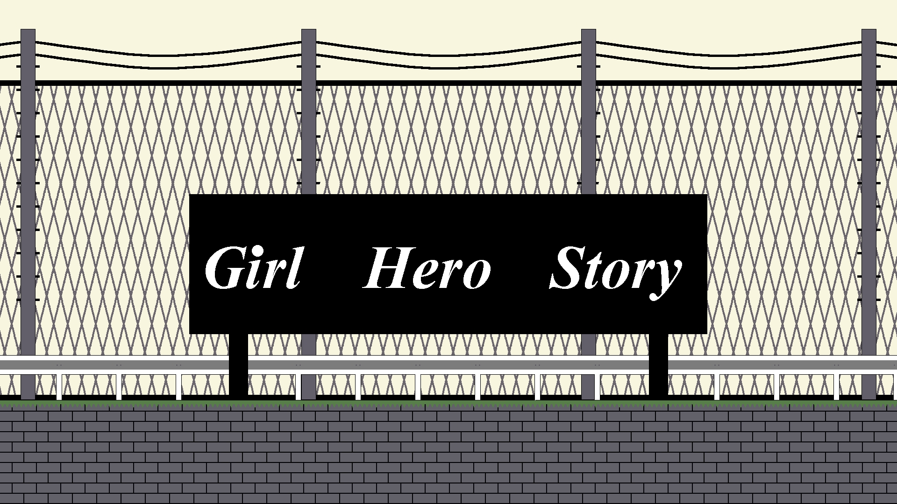
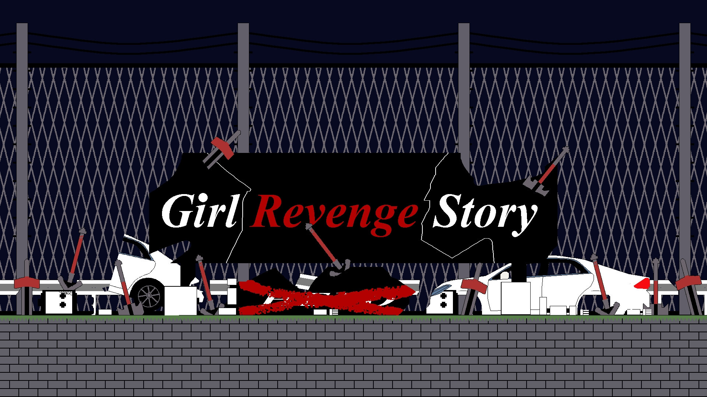
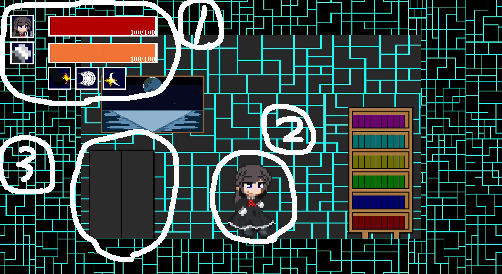

# 　　作成者

河原電子ビジネス専門学校

ゲームクリエイター科1年　森浩希

# 1.　作品概要

<big>・Girl Revenge Story</big>

2D横画面のターン制コマンドバトルRPGゲームです。

<big>・使用エンジン</big>

学校内製エンジンを使用。

<big>・使用ツール</big>

・visual Studio 2022

・Adobe Photoshop 2022

・Aseprite

<big>・開発環境</big>

Windows11

<big>・制作人数</big>

一人

<big>・開発期間</big>

2022年9月～2023年2月　（約三か月間）

# 2.　タイトル

タイトル画面は、偽のタイトルの(GirlHeroStory)と本物のタイトルである（GirlRevengeStory）を使って、タイトル画面でAボタンを押すことにより、本来のタイトル画面を描画するようにしました。

これにより、ゲーム内でストーリーを説明せずとも、ユーザーが推測できる仕組みにしました。

偽のタイトル

本来のタイトル

<video controls src="Title/Title.mp4"></video>

# 3.　操作方法

<big>・ステージ</big>

・十字キー（左右）　:　キャラ移動

・十字キー（上）　　:　マップ移動、ステージ選択

・Ｂボタン　　　　　:　ジャンプ

<big>・戦闘</big>

・十字キー（左右）　:　カーソル移動

・Ａボタン　　　　　:　決定

・Ｂボタン　　　　　:　キャンセル

# 4.  画面説明
　

<big>・画面説明</big>

・①　:　キャラクターのステータス

・②　:　キャラクター

・③　:　マップ移動の扉

# 5.  イラスト

ゲーム内の素材はドットを打つ(Aseprite)を使って自作しました。

# 6.  キャラクターのアニメーション
　

キャラクターのアニメーションは複数の画像を変数の値で管理して、切り替えながら表示しています。

戦闘モーション

立ちモーション

歩行モーション

# 7.  場面切り替え

ゲームの場面切り替えは下記のクラスを使用して実装しています。

1.場面切り替えのアニメーションを再生するクラス（SCREENCHANGEクラス）

2.キャラクターが居る場所を管理したクラス（ANY_MOVEクラス）

3.場所に応じた背景を描画するクラス（BACKGROUNDクラス）

<video controls src="ScreenChange/ScreenChange.mp4"></video>

場面の切り替えは違和感がないようにアニメーションでゲーム画面が覆われた際に2番と3番のクラスが起動して背景の画像を変更します。

# 8.  ステージ

K2Engineの使用上、2Dでカメラを扱うことができないのでキャラクターを動かす代わりに背景を動かしています。

<video controls src = "ScreenChange/StageMove.mp4"></video>

# 9.  戦闘

戦闘システムはターン制コマンドバトルを採用しています。

<video controls src="ScreenChange/Fight.mp4"></video>